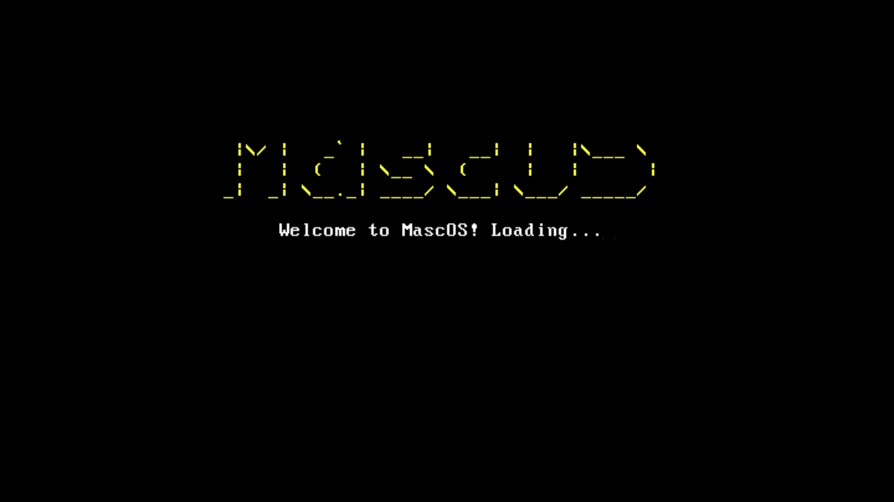
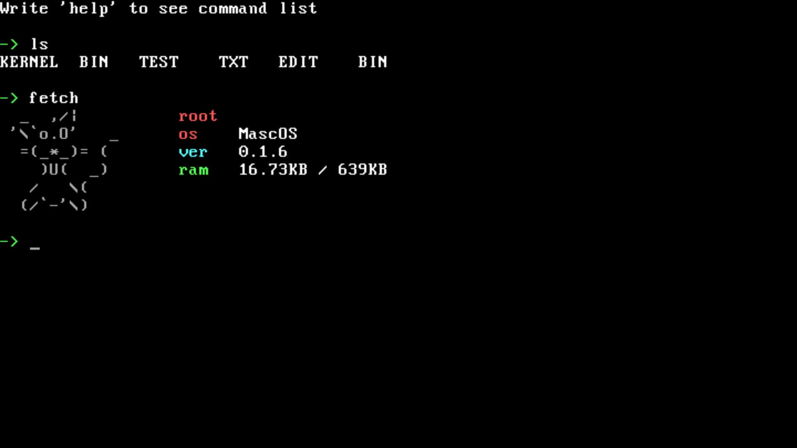

# MascOS
16-bit Real Mode operating system made entirely in Assembly.




## Current situation of the project
The latest version shouldn't have bugs anymore or just a few, since I fixed every one of those I have found. MS DOS programs can *theoretically* run on this not so good operating system, but keep in mind I haven't tested anything and I haven't implemented everything needed for those programs to behave without issues. The "stable" version doesn't have FAT12 and it's there for no reason, other than boosting my energy when I see how much progress I have made since I began this project.

I have tried to boot MascOS with a floppy disk(3.5 inch, 1.44MB) from an external usb floppy drive, and it worked almost flawlessly. It was tested on a Toshiba NB250 laptop.

If you want to learn how to create program for MascOS check [the documentation](ProgramsDocumentation.md).

## Why MascOS
It's a learning project. I thought creating an operating system that targets old hardware would be a fun experiment to deal with.

## Running the operating system
You can use the .flp image provided in the latest release or compile yourself the operating system. For the last one refer to the `Compiling` section of this file.
It's very simple, but first you need to install Qemu (you need `qemu-system-i386`).

Arch
```sh
sudo pacman -S qemu-base
```

Ubuntu/Linux Mint
```sh
sudo apt install qemu
```

After installing Qemu just execute `Run.sh` with:
```sh
sh Run.sh
```

If you want to run this on real hardware you need a computer with legacy BIOS and not a modern UEFI system, since MascOS aims to run on old hardware, and it will hopefully without blowing up anything. To get the operating system image you can head to the Releases page, choose the latest release and download the .flp image, alternatively you can compile the os.

## Compiling
To compile MascOS you need these packages:
 - Nasm

After installing these packages open a terminal window and clone this repo with:
```sh
git clone https://github.com/leo007er1/MascOS.git && cd MascOS
```

Now you can compile the last stable-usable version of MascOS or the latest one, but currently the stable one has some issue on machines other than mine apparently. If you compile the non-stable version you need sudo permissions because the Makefile mounts an image to /dev/loop7. To compile the "stable" versione run:
```sh
make stable
```

If you want to compile the latest version run:
```sh
make
```

Also if you want to remove the compiled files and the os image run:
```sh
make clean
```


## Troubleshooting
#### OS
**1. Why does the text in the edit program blink?**

The VGA driver disables bliking to allow to use all 16 colors for background on real VGA hardware. Unfortunately on simulated VGA this doesn't work, and the text blinks.

#### Compiling
**1. losetup: Build/MascOS.flp: failed to set up loop device: Device or resource busy**

Well if you run `lsblk` you can see your devices and where they are mounted. The Makefile uses /dev/loop7 to build the os, so if you see `loop7` you need to change /dev/loop7 to something like /dev/loop8 in the makefile
