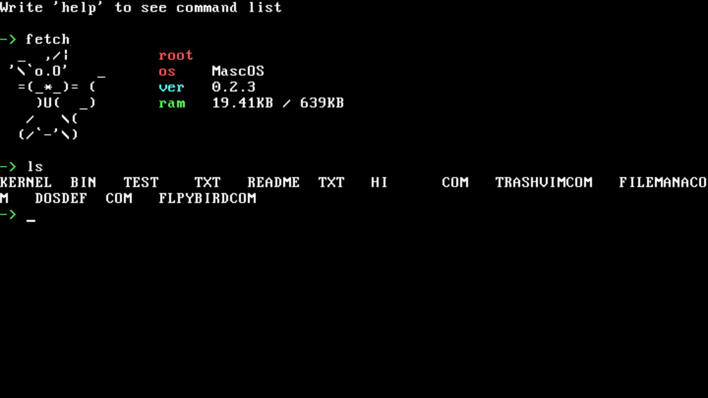

# MascOS
16-bit Real Mode operating system made entirely in Assembly.





## Current situation of the project
The latest version shouldn't have bugs but I did fix every one of those I have found. I tried to run these 2 DOS games: [DOS Defender](https://github.com/skeeto/dosdefender-ld31), an Asteroids clone, and [Floppy Bird](https://github.com/icebreaker/floppybird), a Flappy Bird clone. They work but I can't fully test DOS Defender because I don't have a joystick. Other MS DOS programs can *theoretically* run on this not so good operating system, but keep in mind I haven't tested every program and I haven't implemented everything needed for those programs to behave without issues. The "stable" version doesn't have FAT12 and it's there for no reason, other than boosting my energy when I see how much progress I have made since I began this project.

I have tried to boot MascOS with a floppy disk(3.5 inch, 1.44MB) from an external usb floppy drive, and it worked almost flawlessly. It was tested on a Toshiba NB250 laptop.

If you want to learn how to create program for MascOS check [the documentation](ProgramsDocumentation.md).

## Why MascOS
It's a learning project. I thought creating an operating system that targets old hardware would be a fun experiment to deal with.

## Running the operating system
You can use the .flp image provided in the latest release or compile yourself the operating system. For the last one refer to the `Compiling` section.
It's very simple, but first you need to install Qemu (you need `qemu-system-i386`).

Arch
```sh
sudo pacman -S qemu-base
```

Ubuntu/Linux Mint
```sh
sudo apt install qemu
```

After installing Qemu:
```sh
make run
```

It uses PulseAudio to emulate the pc speaker, so if you're having troubles to run the operating system use this command instead:
```sh
qemu-system-i386 -fda Build/MascOS.flp -M smm=off -no-shutdown -no-reboot \
	-cpu 486 -rtc base=localtime,clock=host
```

If you want to run this on real hardware you need a computer with **legacy BIOS** and *not* a modern UEFI system, since MascOS aims to run on old hardware, and it will hopefully. To get the operating system image you can head to the Releases page, choose the latest release and download the .flp image, alternatively you can compile the os.

## Compiling
To compile MascOS you need these packages:
 - Nasm

To compile the latest version run this command. You need sudo permissions because the Makefile mounts an image to /dev/loop7.
```sh
sudo make
```

You can also choose to compile one of the oldest versions, v0.1.2. There's no purpose for this code to be there other than see how far I have come since I started the project. Note that after compiling it will automatically run the os with Qemu, so you need that installed.
```sh
make stable
```

Also if you want to remove the compiled files and the os image run:
```sh
make clean
```


## Troubleshooting
#### OS
**1. Why does the text in the edit program blink?**

The VGA driver disables bliking to allow to use all 16 colors for background on real VGA hardware. Unfortunately on simulated VGA this doesn't work, and the text blinks.